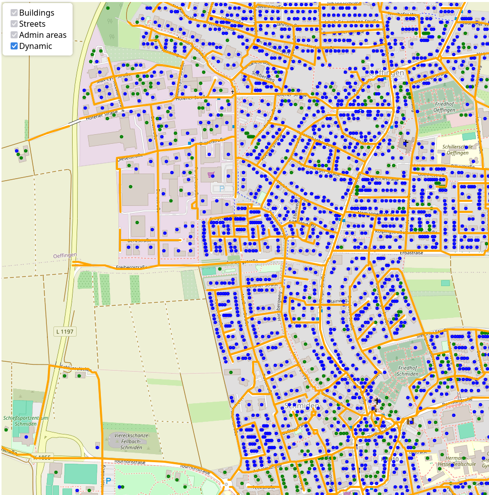
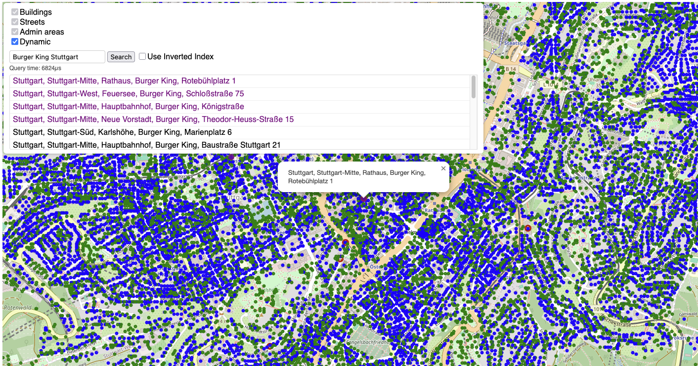
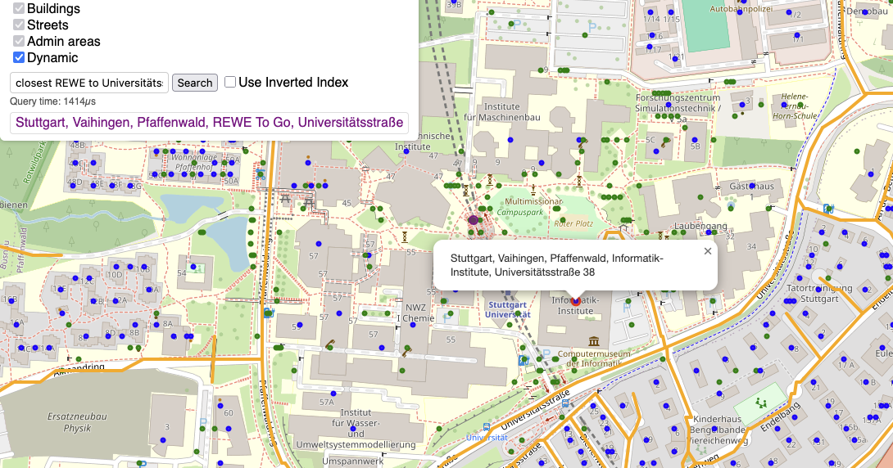
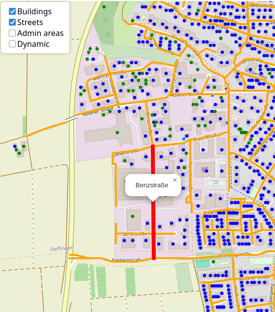
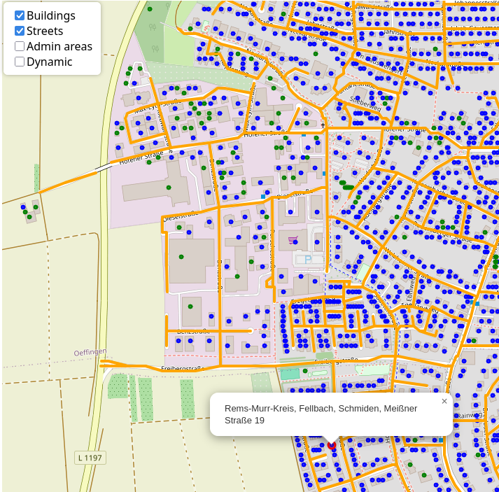
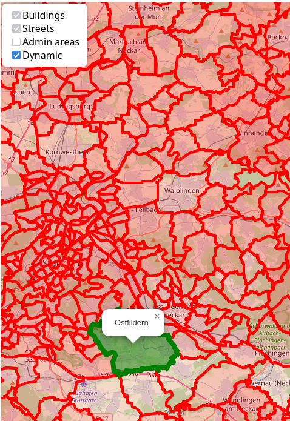

# Requirements

- g++
- make
- libosmium / protozero
- boost

# How to

## Build the project

**Note**: No data sets are provided here, please download them yourself using the [links](#useful-links) below.

First create a dir `build/` in the project root dir:
```bash
mkdir build
```

The project is build with a `Makefile`. To build the release run
```bash
make release
```

to build the debug version run:
```bash
make debug
```

This should create `osm_release` / `osm_debug` executables.

## Use command-line arguments
You can always run
```bash
# <EXECUTABLE> : osm_release | osm_debug
./<EXECUTABLE> --help
```

to get the following print:
```
SYNOPSIS
        ./osm_release [-h] [-bi] [-bo <output file>] [-p <port>] <input file>

OPTIONS
        -h, --help  Print this help
        -bi, --binary_in
                    Input file is in binary format

        -bo, --binary_out <output file>
                    Optional path to output binary file

        -p, --port <port>
                    Port number for the localhost. DEFAULT = 8080

        <input file>
                    Path to OSM file
```

Please acknowledge the order of the arguments in the `SYNOPSIS` block.

**Example**: You want to read in raw OSM data and serialize it to another file (`stuttgart.bin`)
```bash
./osm_release -bo stuttgart.bin stuttgart-regbez-251010.osm.pbf
```

**Example**: Data has already been serialized in a former step. Now the bin data should be parsed and the map should be hosted on port `8090` instead of the default `8080`
```bash
./osm_release -p 8090 -bi stuttgart.bin
```

## Parse and display OSM data

Lets take the same example from above:
```bash
./osm_release -bo stuttgart.bin stuttgart-regbez-260125.osm.pbf
```

The output should look something like this:
```
Parsing stuttgart-regbez-260125.osm.pbf...
Parsing done [11.29s]
Number of buildings: 1874147
Number of streets: 197334
Number of admin areas: 1491
Preprocessing...
        Building hierarchical admin areas kdtrees...
        Hierarchical admin areas kdtrees built [395µs]
        Point in polygon test for buildings using hierarchical admin areas...
        Assigned areas to buildings [10.16s]
        Building buildings kdtree...
        KDtree built [801.24ms]
        Building streets kdtree...
        KDtree built [573.25ms]
        Interpolating street names for buildings without a street assigned to them...
        Street names assigned [21.37s]
        Building inverted index...
        Inverted index built [9.27s]
        Building suffix array...
        Suffix array built [232.12ms]
Preprocessing done [42.42s]
Serializing to stuttgart.bin...
Serialization done [3.63s]
Server started at http://localhost:8080
```

Now you can open `http://localhost:8080` in any browser and explore the hosted map.

## Geocoder

The hosted map should look like this:



Under the checkboxes in the top left corner is an input field.
Search queries can be entered here. Right to the input field
you can decide whether the query should be answered using
an inverted index approach or if unchecked a suffix array.
Suffix arrays allow for subpattern search.

If the `Search` button is clicked (or upon pressing enter on the keyboard)
the query will be answered by the backend. 
This will (if buildings have been found) result in a list of all
matching buildings under the input field and the needed
query time  will be displayed on the right.
Clicking on a building in the list will move the view field to this building.

All found buildings within the view should be displayed with
a purple color in the list and also with a purple marker on the map.

The list of found buildings is sorted by decreasing rank.
The rank is calculated using the following factors:
- High rank for building being inside the view
- Rank scaled to inverse distance of building to center point of the view (farther away = smaller rank)
- Rank scaled to query matching length of building's address (more matching letters = higher rank)

Using the suffix array approach (Inverted Index unchecked) also
enables you to use `Closest <X> to <Y>` queries. This will do the following:
1. Search for all buildings matching `<Y>` and sort them using the heuristics from above
2. Consider the building with highest rank (probably closest match to query)
3. Search for all buildings matching `<X>`
4. Return the building closest to highest rank building by distance 

**Example**: Searching for a building using the suffix array approach:


**Example**: `Closest <X> to <Y>` search:



## Reverse Geocoder

In the top left corner the user can select what objects should be displayed:
- **Building**: Shows all buildings in the current viewport. If the whole address is known, the marker will be blue, if the street was interpolated it will be green.
- **Streets**: Shows all streets in the current viewport. Streets are orange lines.
- **Admin areas**: Shows all admin areas in the current viewport. Admin areas are red opaque polygons.
- **Dynamic** *(Recommended)*: Viewable objects are dynamically displayed depending on the zoom level. Other options cannot be selected if this is checked.

Clicking on the map will select the nearest (visible) object and display the respective name.
If the nearest object is a building, the whole address will be displayed.

**Example**: Buildings and Streets checkboxes are checked. User clicks near a street:


and later on top of a building:


Each object will be marked with the color red and a popup box will display the name.

**Example**: Dynamic object display is selected and user zoomed out a lot. Now clicks on an admin area:



# Useful links
- [geofabrik](https://download.geofabrik.de/index.html)